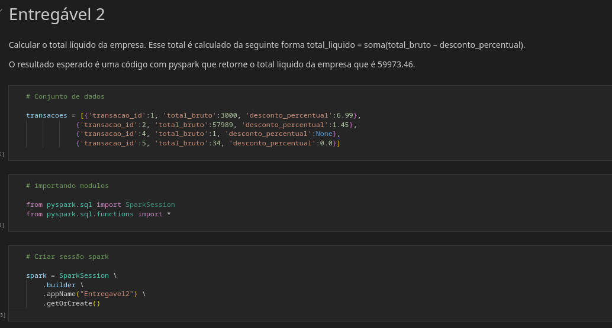
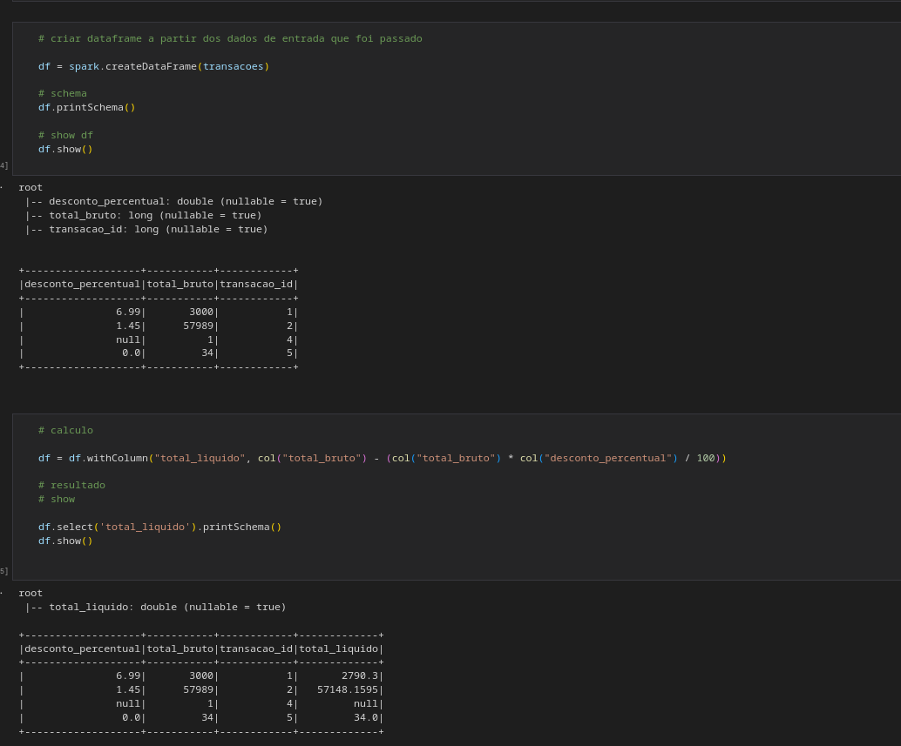
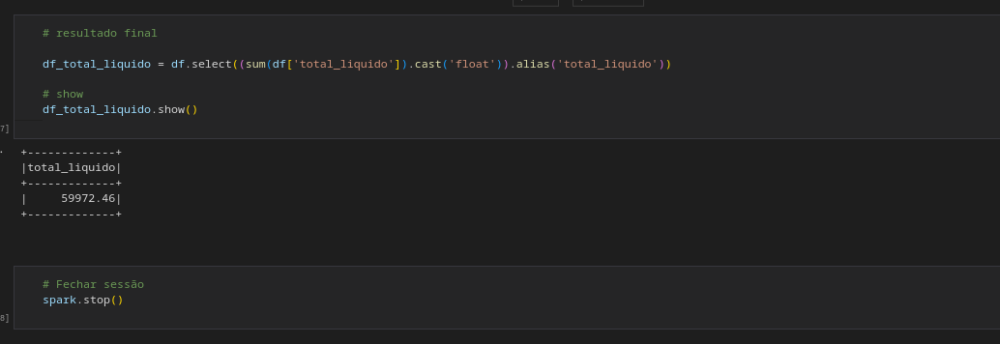

## Desafio 2

* Usando Pyspark, calcular o total líquido da empresa. Esse total é calculado da seguinte forma total_liquido = soma(total_bruto – desconto_percentual).

Acesso ao notebook que foi crido em código pyspark:

* [Notebook](src/entregavel_2.ipynb)

Imagens:

  

  

  

