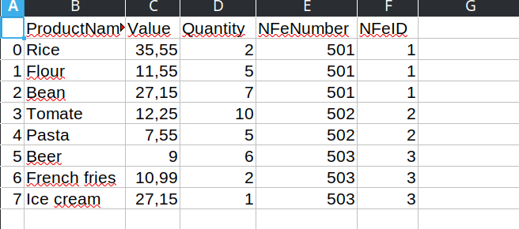

## Desafio 3

* Consiste na transformação de dados disponíveis em arquivo Json para o formato de dataframe, algo comum no dia a dia da empresa.

Acesso ao código desenvolvido em Python, e arquivos .csv gerado:

* [Código](src/entregavel_3.py)

* [Arquivos_csv](files)

Imagens:

  

  

  

