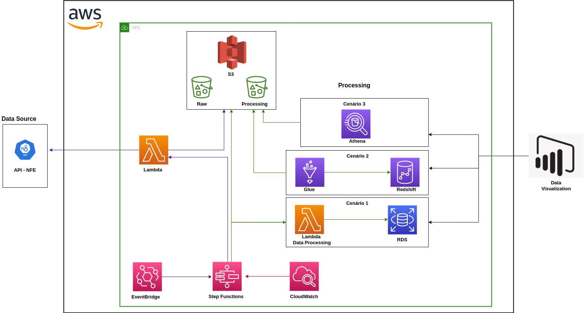

## Desafio 4

* Imagine que o Json das notas fiscais é disponibilizado em uma API. Como você utilizaria as tecnologias da AWS para ingerir, transformar e, eventualmente, carregar esses dados em um Redshift ou oura solução? O quarto entregável consiste na construção de uma arquitetura de ingestão dos dados de nota fiscal do entregável anterior.

Foi desenhado uma arquitetura pensando em simplicidade e custo, mas claro vai depender muito de cada negócio, volume de dados, e pessoas que irão atuar em cima dos dados. Mas com base no entregavel anterior, o desenho consta com arquitetura geral, mas com 3 cenário, na parte de processamento:

* Cenário 1 - Um fluxo de dados simples e barato, usando lambda function, S3 e um banco de dados RDS, e concluindo usando Step Function para orquestrar.

* Cenário 2 - Usando o AWS Glue para fazer o processamento e disponibilizar no Redshift.

* Cenário 3 - E o cenário 3 usando o AWS Athena, fazendo o tratamento de dados via SQL, necessário ter um profissional com conhecimento.

Imagem arquitetura:

  

